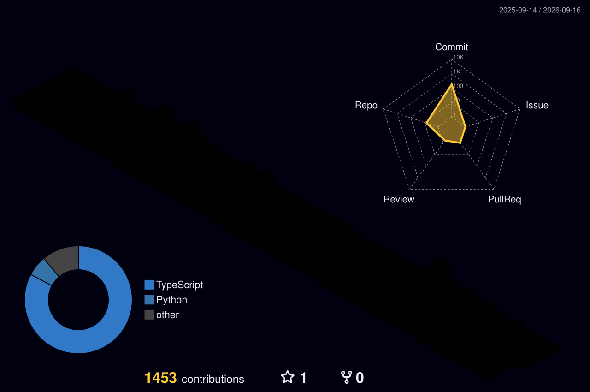

# Hi there! I'm Saharat Meesap (Aon) 👋

[)](https://git.io/typing-svg)

---

### 🧐 About Me

- 💻 I'm **Saharat Meesap (Aon)**.
- 🌱 Currently learning and developing skills in Software Development.
- 🔭 I enjoy working on Open Source projects and exploring new technologies.
- 💬 Ask me about technology or let's share knowledge!
- 📫 How to reach me: [aon.3668@gmail.com](mailto:aon.3668@gmail.com)

---

### 🛠️ Tech Stack

**Languages**
 

**Frontend & UI**
 

**Backend, Database & Data**
 

**Cloud & DevOps**
 

**Tools & Creative**
 

---

### 📊 GitHub Stats

 

 

  

 

---

  

 

  

